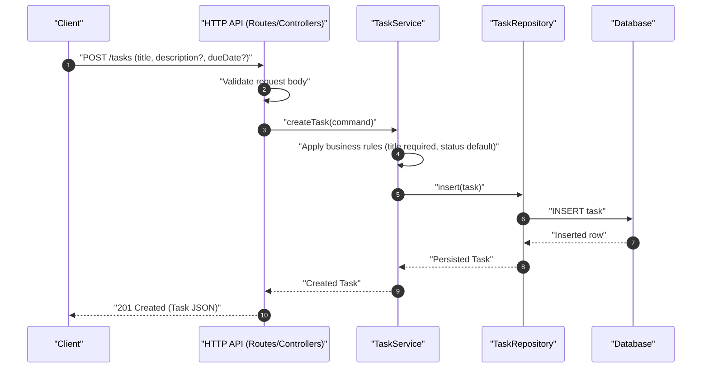
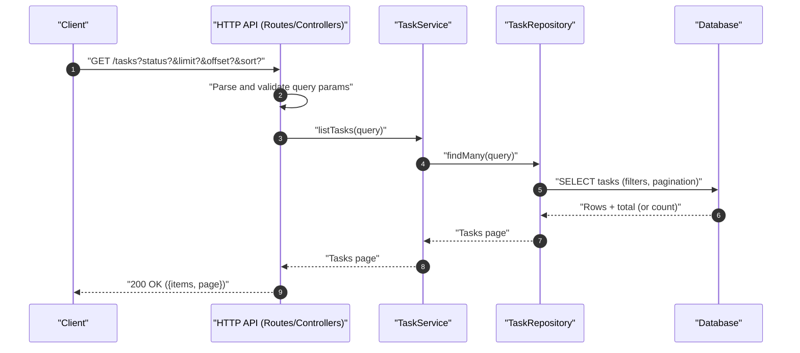

# REST API Draft

## Status and assumptions

This API is a draft intended for a future implementation of the simple task manager backend. It assumes a JSON-over-HTTP REST style and a single monolithic service. It also assumes task IDs are UUIDs and timestamps are ISO-8601 UTC strings.

## Conventions

Requests and responses use application/json unless stated otherwise. All responses should include an appropriate HTTP status code, and errors should follow a consistent error schema.

For successful responses, the body should contain either a task resource or a list of tasks. For delete responses, 204 No Content is recommended.

## Error schema

Errors should be returned as JSON using a stable machine-readable code:

```json
{
  "error": {
    "code": "SOME_CODE",
    "message": "Human readable message.",
    "details": []
  }
}
```

Validation errors may include field-level details:

```json
{
  "error": {
    "code": "VALIDATION_ERROR",
    "message": "Request validation failed.",
    "details": [
      { "field": "title", "message": "Title is required." }
    ]
  }
}
```

## Endpoints

### Summary table

| Method | Path | Description |
| --- | --- | --- |
| POST | /tasks | Create a task |
| GET | /tasks | List tasks |
| GET | /tasks/{id} | Get task by ID |
| PATCH | /tasks/{id} | Update a task |
| DELETE | /tasks/{id} | Delete a task |
| POST | /tasks/{id}/complete | Mark task as completed |
| GET | /healthz | Liveness |
| GET | /readyz | Readiness |

### POST /tasks

Creates a new task.

Request body:

```json
{
  "title": "Buy groceries",
  "description": "Milk, eggs, bread",
  "dueDate": "2026-01-20T00:00:00.000Z"
}
```

Response (201):

```json
{
  "id": "b2b6c6a4-2b7a-4d9d-9f95-4ccf5a8c6f4a",
  "title": "Buy groceries",
  "description": "Milk, eggs, bread",
  "status": "open",
  "dueDate": "2026-01-20T00:00:00.000Z",
  "createdAt": "2026-01-12T00:00:00.000Z",
  "updatedAt": "2026-01-12T00:00:00.000Z"
}
```

Errors:

Returns 400 if validation fails.

### GET /tasks

Lists tasks.

Query parameters (optional):

status, limit, offset, sort.

Example response (200):

```json
{
  "items": [
    {
      "id": "b2b6c6a4-2b7a-4d9d-9f95-4ccf5a8c6f4a",
      "title": "Buy groceries",
      "description": "Milk, eggs, bread",
      "status": "open",
      "dueDate": "2026-01-20T00:00:00.000Z",
      "createdAt": "2026-01-12T00:00:00.000Z",
      "updatedAt": "2026-01-12T00:00:00.000Z"
    }
  ],
  "page": {
    "limit": 50,
    "offset": 0,
    "total": 1
  }
}
```

### GET /tasks/{id}

Gets a task by ID.

Response (200) returns the task representation. Response (404) if the task does not exist.

### PATCH /tasks/{id}

Partially updates a task.

Request body example:

```json
{
  "title": "Buy groceries and supplies",
  "status": "completed"
}
```

Response (200) returns the updated task. Response (404) if not found. Response (400) if validation fails.

### DELETE /tasks/{id}

Deletes a task.

Response (204) on success. Response (404) if not found.

### POST /tasks/{id}/complete

Convenience endpoint to mark a task as completed.

Response (200) returns the updated task. Response (404) if not found.

### Health endpoints

GET /healthz should report process liveness without checking external dependencies.

GET /readyz should report readiness and should fail if key dependencies such as the database cannot be reached.

## Diagrams

This section provides sequence diagrams for core flows, aligned with the draft endpoints defined above.

### Sequence diagram: Create Task (POST /tasks)

Caption: Client creates a task; the backend validates input, applies business rules, persists the task, and returns the created representation.



### Sequence diagram: List Tasks (GET /tasks)

Caption: Client lists tasks; the backend parses filters/pagination, queries storage, and returns a paged list response.


