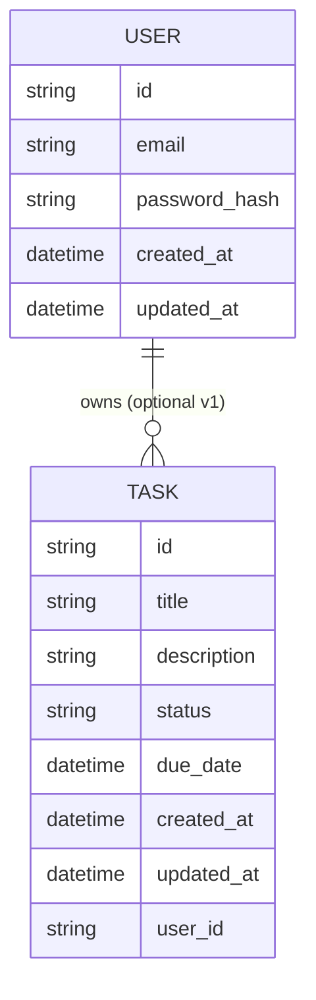

# Data Model Draft

## Status and assumptions

This repository currently contains no database schema or ORM configuration. This document proposes a minimal data model suitable for a simple task manager backend and is intended to be updated when implementation begins.

The draft assumes a relational database (for example PostgreSQL) but can be implemented with SQLite for local development.

## Entities

### Task

A Task is the primary entity in the system.

A task should include:

An id that is globally unique (UUID). A required title. An optional description. A status representing whether the task is open or completed. An optional dueDate. createdAt and updatedAt timestamps.

Status values should be constrained to a small, explicit set. A recommended initial enum is open and completed.

### Optional User

User support is optional for the first version. If the service is intended for multiple users, adding a User entity is recommended to enable authentication and authorization.

A user should include:

An id (UUID), a unique email or username, passwordHash (if using password-based auth), and createdAt/updatedAt timestamps.

If User exists, Task should include a userId foreign key so that tasks are scoped to a user.

## Relational schema (draft)

This is a conceptual schema and not an implemented migration.

Tasks table:

The tasks table should have a primary key id. It should store title, description, status, due_date, created_at, updated_at. If multi-user is enabled, it should also store user_id.

Users table (optional):

The users table should have a primary key id. It should store email (unique), password_hash (if applicable), created_at, updated_at.

## Indexing and query patterns

For a simple task manager, likely query patterns include listing tasks by status and ordering by createdAt or dueDate. Suggested indexes include:

An index on status combined with createdAt for fast listing. An index on dueDate if filtering or sorting by due date is common. If multi-user is enabled, indexes should be scoped by userId, such as (user_id, status, created_at).

## Data integrity rules

Titles should be validated for non-empty content. Status must be constrained to allowed values. Due dates should be valid timestamps. If user support is enabled, userId must reference a valid user and should be enforced with a foreign key.

## Soft delete vs hard delete

The initial version can implement hard deletes for simplicity. If auditing or recovery is desired later, add a deletedAt timestamp and filter it in reads. That change should be captured as a migration and reflected in API semantics.

## Diagrams

### ER diagram

Caption: Conceptual ER model for Task and the optional User entity. This diagram reflects the fields described in this document and is not an implemented schema.

