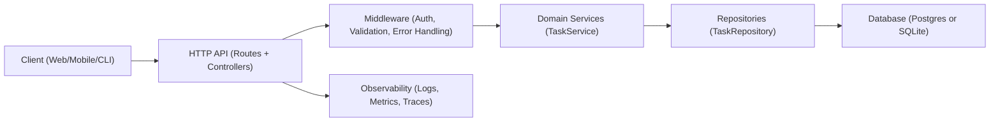

# Architecture Overview

## Status and scope

This repository is currently a scaffold. At the time of writing, there is no implementation code beyond the top-level README. This document therefore proposes a sensible default architecture for a simple task manager HTTP service, and it explicitly calls out assumptions so the documentation can be updated once implementation begins.

This architecture is intentionally monolithic, designed to be easy to implement, test, and operate as a single Node.js service.

## High-level system overview

The system will be a single Node.js backend service that exposes a REST API for creating and managing tasks. It will accept HTTP requests from clients, validate and authorize them, run business rules, and persist tasks to a database. The service will also emit logs and metrics suitable for local development and later production deployments.

At a high level the service will include:

A web/API layer that maps HTTP requests to handlers, a domain layer that expresses task management rules, a persistence layer that reads and writes tasks, and cross-cutting concerns such as configuration, logging, error handling, and health endpoints.

## Goals and non-goals

### Goals

The initial implementation should be:

A small, understandable monolith that is easy to iterate on and easy to test. It should provide a stable REST API for CRUD operations on tasks, implement predictable error handling, and have a clear separation between HTTP concerns, business logic, and persistence.

The service should be operable from day one. It should provide structured logging, health endpoints for orchestration, and basic metrics. Configuration should be environment-variable driven, suitable for container deployment.

### Non-goals

The initial implementation will not aim to be a microservices architecture, and it will not require complex infrastructure such as message queues or service meshes.

Multi-region deployments, advanced search, real-time collaboration, and complex RBAC are considered future extensions rather than initial requirements.

## Proposed architecture

### Module layout (proposed)

The following module boundaries are suggested. Exact filenames may vary, but the responsibilities should remain consistent:

The server/bootstrap module should initialize configuration, logging, the HTTP server, middleware, routing, and graceful shutdown.

The API layer should define routes and controllers. Controllers should translate HTTP input into domain commands, invoke services, and translate results into HTTP responses.

The domain layer should contain entities (for example Task), domain services (for example TaskService), and domain errors. It should not import web frameworks.

The persistence layer should contain repository interfaces and implementations (for example TaskRepository) and database client setup.

The shared/cross-cutting layer should cover configuration, validation helpers, error mapping, logging, metrics, and request IDs.

### Components diagram



### Data flow and request lifecycle

A typical request should follow this lifecycle:

A client sends an HTTP request to an endpoint such as POST /tasks. The server assigns or propagates a request ID and begins request logging. Middleware performs parsing, input validation, authentication (if enabled), and rate limiting (if enabled). The controller maps the request into a command or parameters and calls the domain service. The domain service enforces business rules and uses a repository to persist or retrieve data. The repository interacts with the database via a database client. The controller returns a response DTO, and centralized error handling maps domain or persistence errors into consistent HTTP error responses. Metrics are recorded for request count and latency, and logs capture structured context for debugging.

### Error handling strategy (proposed)

The API should use consistent error payloads across endpoints. Domain errors should be mapped to HTTP codes without leaking internal details. For example, validation failures should be 400, missing resources should be 404, and unexpected exceptions should be 500 with an opaque error code.

A suggested error format is:

An error object containing a stable code, a human-readable message, and optionally a list of field errors for validation.

## REST API surface draft

This is a draft API intended to be simple, conventional, and easy to implement. It can be expanded later.

### Common conventions

All endpoints should use JSON request and response bodies. Timestamps should be ISO-8601 strings in UTC. IDs can be UUIDs. Pagination should be cursor-based or offset-based; for a simple service, offset-based pagination is acceptable initially.

### Endpoints

#### Create task

Method and path: POST /tasks

Request body:

A title is required. Description and dueDate are optional.

Response:

On success returns 201 with the created task.

#### List tasks

Method and path: GET /tasks

Query parameters (optional):

status (for example open or completed), limit, offset, and sort (for example createdAt:desc).

Response:

Returns 200 with a list of tasks and pagination metadata.

#### Get task by ID

Method and path: GET /tasks/{id}

Response:

Returns 200 with the task, or 404 if not found.

#### Update task

Method and path: PATCH /tasks/{id}

Request body:

Any subset of mutable fields such as title, description, status, dueDate.

Response:

Returns 200 with the updated task, or 404 if not found.

#### Delete task

Method and path: DELETE /tasks/{id}

Response:

Returns 204 on success, or 404 if not found.

#### Mark task complete

Method and path: POST /tasks/{id}/complete

Response:

Returns 200 with the updated task, or 404 if not found.

#### Health checks

Method and path: GET /healthz

Response:

Returns 200 if the process is up.

Method and path: GET /readyz

Response:

Returns 200 if dependencies (such as the database) are reachable.

### Example payloads

Example task representation:

```json
{
  "id": "b2b6c6a4-2b7a-4d9d-9f95-4ccf5a8c6f4a",
  "title": "Buy groceries",
  "description": "Milk, eggs, bread",
  "status": "open",
  "dueDate": "2026-01-20T00:00:00.000Z",
  "createdAt": "2026-01-12T00:00:00.000Z",
  "updatedAt": "2026-01-12T00:00:00.000Z"
}
```

Example create request:

```json
{
  "title": "Buy groceries",
  "description": "Milk, eggs, bread",
  "dueDate": "2026-01-20T00:00:00.000Z"
}
```

Example validation error:

```json
{
  "error": {
    "code": "VALIDATION_ERROR",
    "message": "Request validation failed.",
    "details": [
      { "field": "title", "message": "Title is required." }
    ]
  }
}
```

## Data model draft

### Task entity

A Task represents a unit of work a user wants to track.

Suggested fields:

An id as UUID, a title, an optional description, a status (open or completed), an optional dueDate, and createdAt/updatedAt timestamps.

Suggested invariants:

A task must have a non-empty title. Status must be one of the allowed values. If dueDate exists it should be a valid timestamp. updatedAt should be updated on each mutation.

### Optional User entity

User support is optional for the initial version. If added, the data model should include a User entity and associate tasks to a userId. This enables multi-tenant task lists and enables authentication/authorization.

## Deployment and runtime considerations

### Runtime

The service should run as a single Node.js process and listen on a configured port. It should support graceful shutdown by stopping new connections, waiting for in-flight requests, and closing database connections.

### Containers

A container image should run the Node.js process as a non-root user where possible. Readiness and liveness endpoints should be used by orchestrators such as Kubernetes.

### Environment configuration

All configuration should be driven by environment variables, with reasonable defaults for local development. See the dependencies and configuration document for a proposed set.

## Security considerations

The initial scaffold should treat security as a first-class concern even if authentication is postponed.

Input validation should be performed on all incoming data. Error responses should not leak stack traces or internal database details. If authentication is enabled, endpoints that modify tasks should require an authenticated principal and enforce authorization checks to ensure a user can only access their own tasks.

Rate limiting should be considered for public deployments. Secrets (such as JWT signing keys) must never be committed to the repository and must be provided via environment variables or a secret manager.

## Observability and monitoring

The service should emit structured logs that include request IDs and key metadata such as HTTP method, route, status code, and latency. Metrics should include request counts and histograms for latency, along with database error counts. Tracing is optional initially but should be designed in a way that can be added later without major refactoring.

## Dependencies and configuration

The specific technology choices are not implemented yet. A sensible default stack is:

An HTTP framework such as Express or Fastify, a validation library such as Zod or Joi, a PostgreSQL client and migration tool for production use, and a lightweight SQLite option for local development and tests.

Configuration should support selecting the database backend and enabling or disabling authentication.

## Future extensions and scaling path

Once the monolith is stable, scaling should proceed in stages:

First, improve operational maturity by adding tracing, improved metrics, and automated migrations. Next, introduce authentication and multi-user support, then add richer query/filtering, tags, and task ordering. For higher throughput, introduce caching for common reads and optimize database indexing. If the system outgrows a monolith, extract modules along bounded contexts, for example separating task management from user management, but only once clear operational and organizational needs emerge.
